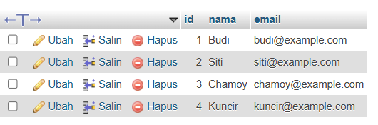
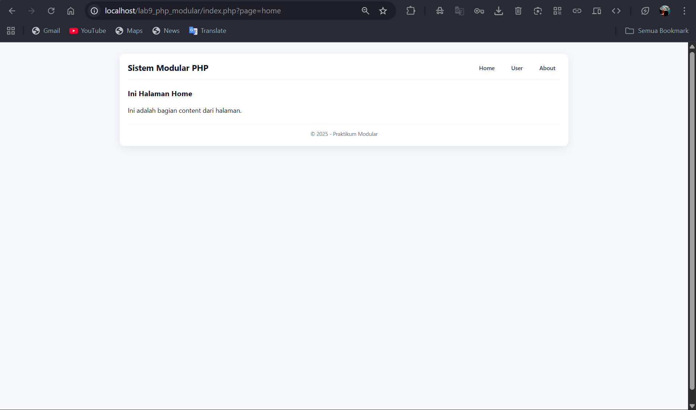
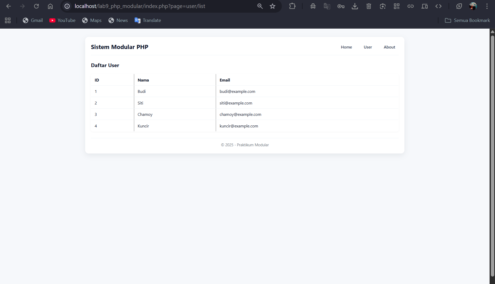

# Lab9Web
# Modular
```
Nama   : Fathan Atallah Rasya Nugraha
NIM    : 312410425
Kelas  : TI.24.A3
```
## Code
### Index.php
```php
<?php 
require "config/app.php";
require "config/database.php";
?>
<link rel="stylesheet" href="assets/css/style.css">
<?php
$page = isset($_GET['page']) ? $_GET['page'] : 'home';

switch($page){
    case 'home':
        include "views/home.php";
        break;

    case 'user/list':
        require "modules/user.php";
        user_list();
        break;

    case 'about':
        include "views/about.php";
        break;

    default:
        echo "404 Page Not Found";
}
?>
```
### header.php
```php
<!DOCTYPE html>
<html>
<head>
    <title>Modular Project</title>
    <link rel="stylesheet" href="style.css">
</head>
<body>
<div class="container">
<header>
    <h1>Sistem Modular PHP</h1>
    <nav>
        <a href="index.php?page=home">Home</a>
        <a href="index.php?page=user/list">User</a>
        <a href="index.php?page=about">About</a>
    </nav>
</header>
```
### footer.php
```php
<footer>
    <p>&copy; 2025 - Praktikum Modular</p>
</footer>
</div>
</body>
</html>
```
### user.php
```php
<?php

function user_list() {
    include "config/database.php";
    global $conn;

    $query = mysqli_query($conn, "SELECT * FROM users");

    include "views/user/list.php";
}
```
### app.php
```php
<?php
$base_url = "http://localhost/lab9_php_modular/";

$app_name = "Modular PHP App";

date_default_timezone_set("Asia/Jakarta");

function url($path = "") {
    global $base_url;
    return $base_url . $path;
}
```
### database.php
```php
<?php
$host = "localhost";
$user = "root";
$pass = "";
$db   = "latihan1";

$conn = mysqli_connect($host, $user, $pass, $db);

if (!$conn) {
    die("Koneksi database gagal: " . mysqli_connect_error());
}
```
### list.php
```php
<?php include "views/header.php"; ?>

<h2>Daftar User</h2>
<table border="1">
    <tr>
        <th>ID</th><th>Nama</th><th>Email</th>
    </tr>

    <?php while($row = mysqli_fetch_assoc($query)) : ?>
        <tr>
            <td><?= $row['id']; ?></td>
            <td><?= $row['nama']; ?></td>
            <td><?= $row['email']; ?></td>
        </tr>
    <?php endwhile; ?>
</table>

<?php include "views/footer.php"; ?>
```
### home.php
```php
<?php require('header.php'); ?>

<div class="content">
    <h2>Ini Halaman Home</h2>
    <p>Ini adalah bagian content dari halaman.</p>
</div>

<?php require('footer.php'); ?>
```
### about.php
```php
<?php require('header.php'); ?>

<div class="content">
    <h2>Ini Halaman About</h2>
    <p>Ini adalah bagian About dari halaman.</p>
</div>

<?php require('footer.php'); ?>
```
### Tabel user pada database


# Output
## Tampilan Home


## Tampilan User


## Tampilan About

